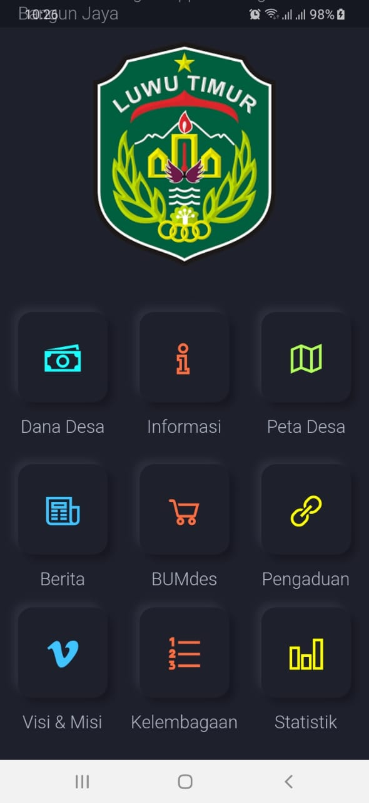
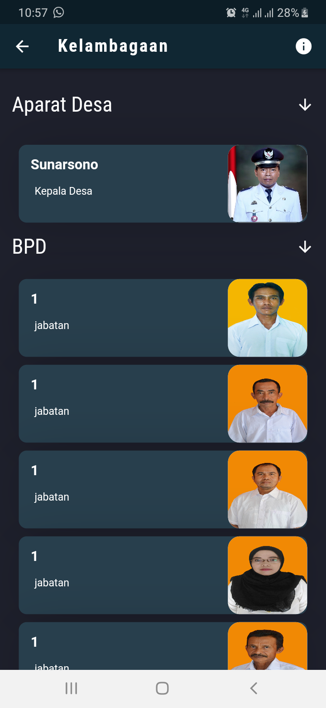

## AppDesa Bangun Jaya 🗺
````
git clone repo_url
````

# Preview Gambar Applikasi




# Todo App Desa

 * [x] Bikin Screen Informasi 💁
    * [x] Buat Screen Informasi Desa

 * [x] Bikin Screen Bumdes 💁
    * [x] Buat list Table Bumdes Yang Sedang Berjalan Di Desa

 * [x] Bikin Screen Statistik 💁
    * [x] Add Bar Chart 🍁
    * [x] bar Chart Dengan Dummy Data

* [x] Peta Desa 🍁
    * [x] Direct langsung Lokasi Bangun jaya
    * [x] ambil lokasi Sekarang ;

* [x] Splash Screen 🍁
    * [x] tunggu 5 detik Masuk ke home Page

* [x] Screen Kelembagaan 🍁
    * [x] Add Staf 

* [x] Screen Pelayanan 🍁
    * [x] show Pelayanan Desa
    * [x] add form  request
    * [x] field nama 
    * [x] field nik
    * [x] field alamat
    * [x] field noHp
    * [x] Send req Ke admin Desa

* [x] Screen Berita
    * [x] Get Berita nya Youtube Desa

* [x] Buat Statistik Desa 
    * [x] Statistik Penduduk 

* [x] All Done ♨  ♨  ♨